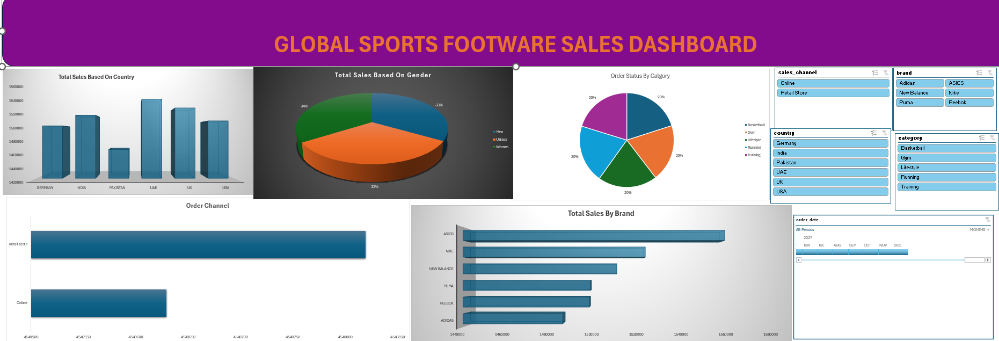
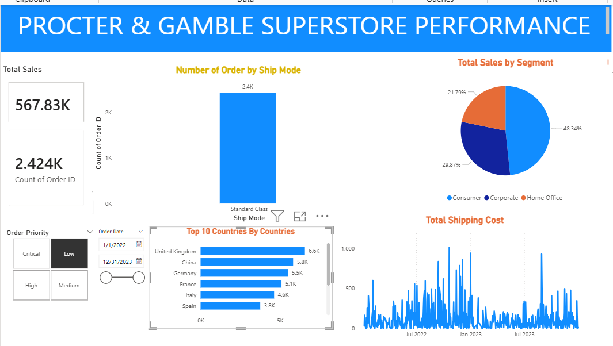
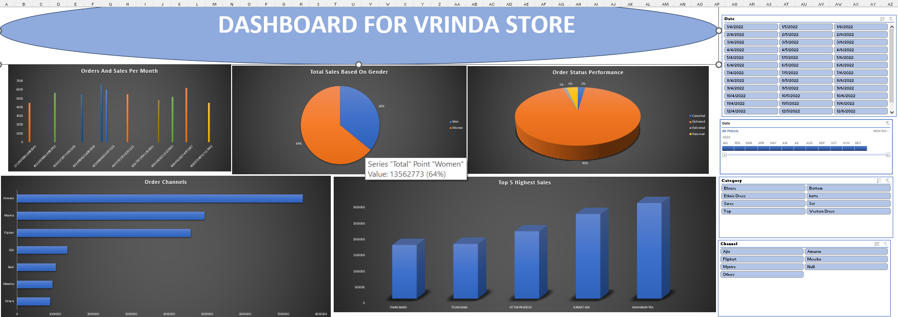

# Data Analytics Portfolio

# Project 1
**Title:** [Global Sports Footwear Sales](https://github.com/emiolasamson3-maker/emiolasamson3.github.io/blob/main/global_sports_footwear_sales_2018_2026.xlsx)

**Tools Used:** Microsoft Excel(Pivot Table, Pivot Charts, Power Query Editor, Slicers, Conditional Formatting, Text Box)

**Project Description:** This project involved analyzing a global sports footwear dataset to identify sales trends across different regions, demographics, and brands. Using Power Query, I cleaned and transformed the raw data, then utilized Pivot Tables to aggregate the metrics. The goal was to create an interactive dashboard that provides stakeholders with a high-level view of business performance and operational efficiency.

**Key Findings:**
**Top Performer:** ASICS leads the brands in total sales, followed by Nike, indicating a strong market preference for their products within this dataset.

**Demographic Balance:** Sales are remarkably well-distributed across genders, with Men, Women, and Unisex categories each capturing approximately 33-34% of the total market share.

**Regional Strength:** The UAE and UK show significantly higher sales volume compared to Pakistan, suggesting these are primary growth markets.

**Order Efficiency:** The "Order Status By Category" pie chart shows a relatively even split across five categories, suggesting a diverse but stable product movement.

**Dashboard Overview:** 

The dashboard provides a 360-degree view of the sales ecosystem through five key visualizations

**Sales by Country:** A bar chart identifying geographic performance.

**Total Sales Based on Gender:** A 3D pie chart showing the demographic split.

**Order Status by Category:** A pie chart detailing the health of order fulfillment.

**Order Channel:** A horizontal bar chart comparing how customers are buying.

**Total Sales by Brand:** A ranked horizontal bar chart showing brand competitiveness.

# Project 2

**Title:** SQL Data Defination Language-Sales Data 

**SQL Code:** [Sales Data](https://github.com/emiolasamson3-maker/emiolasamson3.github.io/blob/main/Sales_Data.sql)

**SQL Skills Used:** Multi-Table Joins: Utilizing LEFT JOIN and INNER JOIN to aggregate data across Customer, Salesman, and Orders tables.

**Data Filtering & Predicates:** Implementing complex logic using BETWEEN, WHERE, and IS NULL for precise data extraction.

**Conditional Logic:** Writing CASE statements to categorize order statuses and salesperson assignments.

**Data Organization:** Using ORDER BY and Aliasing (AS) to ensure report readability and professional formatting.

**Set Operations:** Handling relational logic to identify gaps in assignments (e.g., customers without orders or salespeople without assigned customers).

**Project Description:** In this project, I acted as a Data Analyst for a retail/distribution firm to streamline their sales reporting process. I developed a suite of SQL queries designed to bridge the gap between three core datasets: Customers, Sales Representatives, and Transactional Orders.

**Key Objectives Achieved:**

**Sales Performance:** Identified high-value transactions (orders between 500 and 2000) to help management focus on mid-to-high tier sales.

**Relationship Mapping:** Created reports to audit the relationship between sales agents and their assigned cities/customers, ensuring no accounts were left unmanaged.

**Commission Auditing:** Filtered sales personnel based on commission thresholds (over 12%) to analyze incentive structures.

**Exception Reporting:** Developed a comprehensive "Order Status" report using CASE logic to identify if orders were placed through assigned agents, different agents, or independently, which is crucial for resolving commission disputes.

**Technology used:** SQL Server

# Project 3
**Title:** [Procter & Gamble Superstore Performance](https://github.com/emiolasamson3-maker/emiolasamson3.github.io/blob/main/Procter%20%26%20Gamble%20Performance.pbix)

**Tools Used:** Power BI Desktop, DAX (Data Analysis Expressions), Power Query.

**Project Description:** This project involved developing a comprehensive sales and logistics dashboard for a global retail superstore. The goal was to provide executive leadership with a high-level view of revenue performance, customer segmentation, and supply chain efficiency. I transformed raw transactional data into interactive visuals to help stakeholders identify which regions and shipping methods drive the most value.

**Keys Findings:** Market Dominance: The United Kingdom leads as the top-performing country by order volume ($6.6\text{K}$), followed closely by China and Germany. This suggests a strong European market presence.

**Customer Segmentation:** The Consumer segment is the primary revenue driver, accounting for nearly half of all sales (48.34%), while the Home Office segment represents the smallest share at 21.79%.

**Logistics Preference:** "Standard Class" is overwhelmingly the preferred shipping mode ($2.4\text{K}$ orders), indicating that customers prioritize cost-savings over delivery speed.

**Shipping Cost Volatility:** The line chart reveals significant spikes in shipping costs throughout 2022 and 2023. This identifies specific periods where logistics overhead may have impacted profit margins, warranting a deeper audit of carrier rates during those peaks.

**Dashboard Overview:** 

# Project 4
**Title:** [Vrinda_Store_Dashboard](https://github.com/emiolasamson3-maker/emiolasamson3.github.io/blob/main/Vrinda_Store_Dashboard.xlsx)

**Tools Used:** Microsoft Excel( Data Cleaning, Data Processing, Pivot Table, Pivot Charts, Power Query Editor, Slicers, Conditional Formatting, Text Box)

**Project Description:** This project involves a comprehensive data analysis of Vrinda Store’s retail operations for the year 2022. The objective was to transform raw transactional data into a visual story that empowers the store owner to understand customer behavior, identify top-performing regions, and optimize sales strategies for the upcoming year.

**Key Findings:**
**Target Demographics**
**Primary Audience:** Women are the top contributors, accounting for approximately 64–65% of total sales.

**Age Group:** The Adult demographic (ages 30–49) is the most profitable segment, contributing nearly 50% of total revenue.

**Geographical & Channel Insights**
**Top States:** Maharashtra, Karnataka, and Uttar Pradesh consistently rank as the top three states for sales volume.

**Dominant Channels:** Amazon, Flipkart, and Myntra are the powerhouse channels, together driving the majority of orders.

**Operational Performance**
**Fulfillment:** A high percentage (~92%) of orders are successfully Delivered, indicating a healthy supply chain with low return rates.

**Seasonality:** Sales typically peak in the first quarter (especially March), suggesting that marketing spend should be optimized for early-year campaigns.

**Dashboard Overview:** 

The dashboard provides a 360-degree view of the sales ecosystem through five key visualizations

**Orders and Sales Per Month:** A combination or bar chart showing seasonality and growth trends throughout the year.

**Total Sales Based on Gender:** A pie chart highlighting the primary revenue-driving gender.

**Order Status Performance:** A 3D pie chart visualizing the efficiency of fulfillment (Delivered, Cancelled, Returned, etc.).

**Top 5 Highest Sales:** A bar chart identifying the top-performing categories or states.

**Order Channels:** A horizontal bar chart showing where customers are purchasing (Amazon, Flipkart, Myntra, etc.).

**Interactive Slicers:** Filtering tools for Date, Category, and Channel to allow for dynamic data exploration.

# Project 5

**Title:** SQL Data Defination Language-Sales Data 

**SQL Code:** [Employees_Records](https://github.com/emiolasamson3-maker/emiolasamson3.github.io/blob/main/Employees_Records.sql)

**SQL Skills Used:** Basic Data Retrieval: SELECT *, SELECT DISTINCT (selecting specific columns like Project).

**Advanced Filtering:** Using WHERE clauses with BETWEEN, IN, and Comparison Operators (<>).

**Logical Operators:** Combining multiple conditions using AND and OR.

**Pattern Matching:** Using the LIKE operator with wildcards (e.g., '__HN%') to find specific text strings.

**Aggregate Functions:** Calculating summary statistics using SUM, COUNT, MAX, MIN, and AVG.

**Calculated Fields:** Performing arithmetic operations within a query (e.g., [Salary] + [Variable] AS [Total Salary]).

**Set Operations:** Using UNION to combine results from multiple tables (EmployeeDetails and EmployeeSalary).

**Data Definition (DDL):** Basic schema modification using ALTER TABLE and DROP COLUMN.

**Project Description:** In this project, I worked as a Data Analyst for a construction company, where I used SQL Server to analyze employee and salary data by writing queries to retrieve employee information, identify projects, calculate salary statistics (maximum, minimum, and average), filter employees based on managers, locations, and salary ranges, and combine data from multiple tables to generate meaningful insights for organizational reporting.

**Key Objectives Achieved:**

**Efficient Data:** RetrievalSuccessfully wrote SQL queries to retrieve employee information such as employee ID, full name, manager details, and project assignments from the employee database.

**Employee Management Analysis:** Identified employees working under specific managers and analyzed reporting structures within the organization.

**Project Participation Insights:** Extracted distinct project names and determined the number of employees working on specific projects such as P1.

**Salary Analysis and Reporting:** Calculated important salary statistics including maximum salary, minimum salary, and average salary to support management decision-making.

**Data Filtering and Conditions:** Applied SQL filtering techniques using WHERE, AND, OR, BETWEEN, and LIKE clauses to extract targeted employee records based on salary ranges, city, and name patterns.

**Database Query Optimization Skills:** Demonstrated the use of SQL operations such as aggregation functions, pattern matching, and UNION to combine data from multiple tables effectively.

**Compensation Calculation:** Computed total employee compensation by combining base salary with variable components.

**Practical Database Management Experience:** Strengthened practical knowledge of SQL Server database querying, employee record analysis, and structured data management.

**Technology used:** SQL Server
